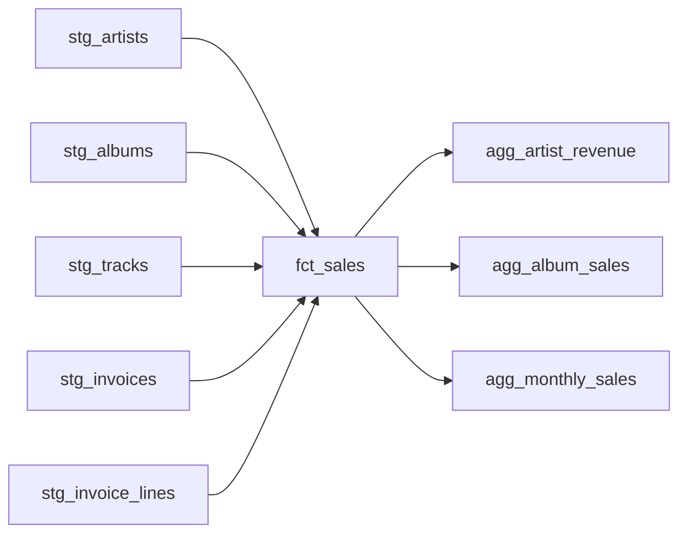

# mini-dbt-project

This is a mini project to practice dbt. It uses Chinook dataset from (https://github.com/lerocha/chinook-database/releases)

# Set up your environment

Create and activate a virtual environment, then install dbt with the Postgres adapter:

```
python3 -m venv .venv
source .venv/bin/activate
```

Install necessary packages from requirements.txt:

```
pip install -r requirements.txt
```

Verify the install:

```
dbt --version
```

# Configure your env variables in the format

```
PG_HOST=localhost
PG_PORT=5432
PG_USER=user
PG_PASSWORD=password
PG_DATABASE=chinook
PG_SCHEMA=dbt_dev
```

# Project structure

```
mini-dbt-project/
├── data/
│   ├── Chinook_PostgreSql.sql   # Chinook dataset SQL dump
│   └── README.md                # steps to load the dataset into Postgres
├── models/
│   └── staging/                 # staging models (materialized as views)
├── .env.example                 # template for local environment variables
├── dbt_project.yml              # dbt project configuration
├── docker-compose.yml           # Postgres service for local development
├── profiles.yml                 # dbt connection profile (reads from env vars)
└── requirements.txt             # Python dependencies (dbt-postgres)
```

# Start Postgres and load the data

See [data/README.md](data/README.md) for spinning up the container and loading the Chinook dataset.

# Check connection

Run these from the project root. Since `profiles.yml` isn't in `~/.dbt/`, add `--profiles-dir .` to each command (or set `DBT_PROFILES_DIR=.`).

```
dbt debug --profiles-dir .
```

# Generate documentation

Build and view dbt's interactive docs site, including the full lineage graph and column-level catalog:

```
dbt docs generate --profiles-dir .
dbt docs serve --profiles-dir .
```

This starts a local server (default `http://localhost:8080`) and opens the docs in your browser. Generated files land in `target/` and are gitignored.

# Data lineage


